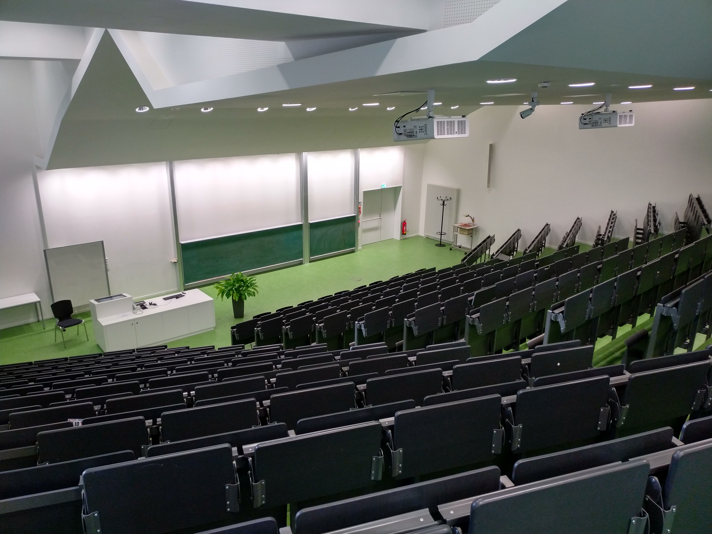
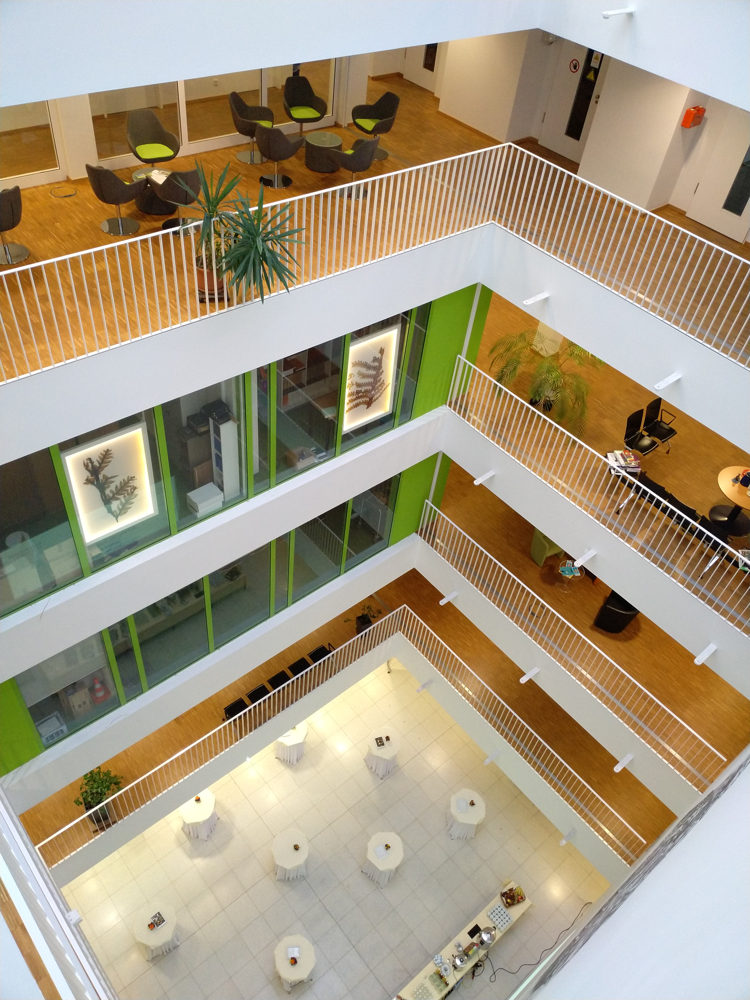

# OpenGeoHub Summer School 2019 - General Information

Dear participants and lecturers of the OpenGeoHub summer school 2019 in Muenster.
In this document you will find general information and tips for your stay in Muenster. It will be updated and 
extended continuously as the summer school approaches. Make sure to check this page again shortly before
your trip.

### Venue

The Institute for Geoinformatics is located in the GEO 1 building at Heisenbergstraße 2 in the Northwest of Muenster
where it resides together with the Institutes of Landscape Ecology, Geography, and Didactics of Geography.
GEO 1 will also be the venue of this year's summer school. The plenaries/lectures will be held in the main lecture hall,
which you will find on the ground floor directly next to the main entrance. 

	
The parallel sessions will be held in three seminar rooms located on the second (242), third (323) and 
fourth floor (401). 

We will make sure to hang up enough 
signs so that you can easily find every room. In addition, you can use the GEO 1 information system (located next to the 
lecture hall) that will give you turn-by-turn directions to any room, person or institute.
Coffee breaks and lunches will be in the atrium on the ground floor.

	
	
### Public Transport

You will receive free bus tickets valid throughout the week of the summer school. You can use these
tickets in all buses in Muenster.

In the map below we have inserted some bus stops you can use for getting from your hotels to GEO1
and back. For a map with all bus stops and a journey planner [click here](https://westfalenfahrplan.de/std3/XSLT_TRIP_REQUEST2?language=en&itdLPxx_contractor=swm&type_origin=any&type_destination=any&custom_suggestMacro=true&std3_commonMacro=trip&std3_customMacro=true).

Some helpful tips about travelling by bus in Muenster can be found in this [flyer](https://www.stadtwerke-muenster.de/fileadmin/stwms/busverkehr/produkte/flyer/SWMS_Infofolder_Busfahren_2016.pdf).

An overview of all routes in Muenster can be found here:

- [daytime schedule](https://www.netzplan-muenster.de/index.php/de/netzplan)
- [nighttime schedule](https://www.stadtwerke-muenster.de/fileadmin/stwms/busverkehr/kundencenter/dokumente/netzplaene/MS_NachtNetz_topografisch_2019_04_29.pdf)

### Arrival on Sunday: How to get to your Hotel or the venue 

Here are the directions for getting to GEO 1 or different hotels when arriving in Muenster at the train station 
or the airport (here I show directions for most convenient (least walking) lines only, I consider 
 schedules on Sunday, on other weekdays there are usually more lines available).
If you would like to know directions to other hotels, please contact me or use the [journey planner](https://westfalenfahrplan.de/std3/XSLT_TRIP_REQUEST2?language=en&itdLPxx_contractor=swm&type_origin=any&type_destination=any&custom_suggestMacro=true&std3_commonMacro=trip&std3_customMacro=true)
mentioned in "Public Transport"

#### Arrival at train station ("Hauptbahnhof"):
There is a bus hub directly in front of the station that serves most of the bus lines in Muenster.

To get to **GEO 1**:

- Take the bus number 2 from platform C1, direction "Alte Sternwarte", exit at bus stop "Mendelstraße"

 

To get to Hotel **"Seezeit"**:

- take the bus number 2 from platform C1, direction "Alte Sternwarte", exit at bus stop "Offenbergstraße"

**or**

- take the bus number 10 from platform C1, direction "Meckmannweg", exit at bus stop "Offenbergstraße"

 

To get to Hotel **"Jellentrup"**:

- take the bus number 11 from platform C1, direction "Dieckmannstraße", exit at bus stop "Jungeblodtplatz"

**or**

- take the bus number 14 from platform B1 (direction "Münster Zoo"), exit at bus stop "Jungeblodtplatz"

 

To get to Hotel **"Haus Niemann"**:

- take the bus number 2 from platform C1 (direction "Alte Sternwarte"), exit at bus stop 
  "Horstmarer Landweg"

   

To get to Hotel **"Haus Hüerländer"**:

- take bus number 5 from platform B1 (direction "Nienberge Hannaschweg"), exit at bus stop "Haus
    Rüschhaus"
   
 
    
To get to Hotel **"Überwasserhof"**

- take bus number 5 from platform B1 (direction "Nienberge Hannaschweg"), exit at bus stop "Münzstraße"

**or**

- take bus number 1 from platform B1 (direction "Roxel"), exit at bus stop "Schlossplatz"

 

#### Arrival at airport:

There is a bus connection (two lines) from the airport to the main train station in Muenster. It is probably 
the easiest way to take this shuttle to get to the train station and then proceed as described above.
The schedule for the bus lines can be found [here](https://www.fmo.de/fileadmin/fmo/media/content/service/2019-01-30_15_50_55-FMO_SuP_Flyer_Winter_2018_19_DE.pdf.png)
(check departures for Sunday under "Sonn- u. Feiertag")
Depending on where you stay, it might be easier to exit/change line at an earlier bus stop. Please use the 
[journey planner](https://westfalenfahrplan.de/std3/XSLT_TRIP_REQUEST2?language=en&itdLPxx_contractor=swm&type_origin=any&type_destination=any&custom_suggestMacro=true&std3_commonMacro=trip&std3_customMacro=true) 
to find out. 

### Wifi

The Wifi of the University of Muenster is available in most of the University´s buildings, and 
since the University is spread all over the city, it is often worthwhile checking for the University SSIDs wherever you 
are in Muenster.

eduroam: If your home institution is part of this initiative, use eduroam, just log in with your usual credentials.

GuestOnCampus: Any guest can connect to this Wifi without any credentials. After connecting and opening your
browser, you will be redirected to the login page. Please note, that the data volume is restricted to 1 GB per day and 
the connection is not encrypted.

### Dining and Going-Out

If in one evening you find yourselves not sated by R and drunk with Python there are quite a few places 
to go for a drink or for dinner in Muenster. We do not feel qualified to give recommendations about specific restaurants 
or bars that fit any given taste, so we have instead marked several streets/quarters on the map below that are great 
spots to go out at night.
Please note that if you stay late and want to ride the bus, there are different schedules and different routes active at
night (starting at around 9 PM and marked with a capital "N", see also [the nighttime route overview](https://www.stadtwerke-muenster.de/fileadmin/stwms/busverkehr/kundencenter/dokumente/netzplaene/MS_NachtNetz_topografisch_2019_04_29.pdf)). The journey planner that we have put a link to in
"Public Transport" accounts for that.

### Excursion

The excursion on Saturday will consist of two parts. First, we will visit the protected area "Rieselfelder", a 
European bird reserve close to Muenster, where we will have a guided tour. Afterwards there will be a lunch break in a 
nearby restaurant/café. 
For the second part we will return to Muenster and ....
- we will meet at 9:00 AM at the GEO 1 building
- a bus will take us to the "Rieselfelder" where we will have the guided tour
- after the tour we will walk to the restaurant and have a lunch break
- after the lunch break the bus will pick us up at the restaurant an take us back to Muenster
- in Muenster there will be the ... tour
- we expect finish at around ...
- afterwards you are free to join us to explore some of the many events during the cultural festival 
"Schauraum" and have a drink or two if you still have time

### "Schauraum Münster"
From Sep 5 to Sep 7 there is a festival of museums and galleries in Muenster ([see here](https://www.stadt-muenster.de/ms/tourismus/presse/html/21-schauraum-EN.html))
This is the reason why Muenster will be full and why it was so difficult to find available hotels, tours etc. but it is
also a nice option to visit after the summer school.
On Saturday, museums and galleries throughout Muenster will be open and free of charge until midnight!

### Weather

Muenster is somewhat famous for its bad weather. This does not mean that it is always raining (in fact this summer has 
so far mostly been very warm and sunny) but chances of rain are quite high so you should be prepared for that. 

### Map
This map contains some hotels and important points of interest to assist you in orientating. Since you are staying in different places,
we have just added the
locations of those hotels we had made pre-reservations at, along with the corresponding bus stops and directions to get 
to GEO 1. 
If you want to know how to get to GEO 1 from a place that is not in the map, please contact me or use the journey planner mentioned 
in "Public Transport".

### Important Phone Numbers

- Fire brigade / ambulance: 112
- Police: 110
- My number: I have posted the number in mattermost here

